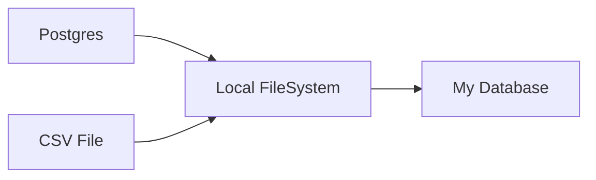

# Indicium Code Challenge
*By Luis Kuodrek*

Data pipeline design for the Indicium Code challenge


## The Challenge Synopsis

Build a pipeline that extracts the data everyday from two sources (A database and a csv file) and write the data first to local disk, and second to a output database. The final goal is to run a query that shows the orders and its details.


More info about the challenge can be found at: https://github.com/techindicium/code-challenge


## Solution

I used [Airflow](airflow.apache.org/) v2.2.4, which helped me describe, execute and monitor my workflow. 

I also used Docker / Docker-compose to containerize my pipeline so it can run universally on any OS.

### Tasks
The pipeline main tasks are:
1. Extract data from Postgres database and write to local filesystem
2. Extract data from CSV file and write to local filesystem
3. Extract data from local filesystem, transform and load to a final database
4. Realize a query to extract the order and its details into a CSV file.

Every task was written as a Python script. I printted pretty much all of the steps for each task so it becomes easier to see where the pipeline failed.

**Task1: extract_northwind_db** 
1. Connect to Postgres Database
2. Get the names of all tables
3. Check if folders for CSV files are created; If not, create that directory
4. Write data into CSV file
```python
import psycopg2
import os
import sys
from task_utils import  get_tables

# Get {{ execution_date }}
exec_date  = sys.argv[1][:10]

# Connect to northwind database
host  =  "northwind_db"
database  =  "northwind"
user  =  "northwind_user"
password  =  "thewindisblowing"

db_conn  = psycopg2.connect(host=host, database=database, user=user, password=password)
db_conn.set_client_encoding("UTF8")
db_cursor  =  db_conn.cursor()

def  sql_to_csv(db_cursor, table_name):
	# Get path file
	path_file  =  "/data/postgres/{0}/{1}".format(table_name, exec_date)
	
	# Check if directory exists
	isExist  = os.path.exists(path_file)

	# Check if a directory exists and create if it doesnt
	if  not  isExist:
		os.makedirs(path_file, exist_ok=True)
		print(f"Folder {table_name} created successfuly")
		
	# Append data name to path file
	path_file  +=  "/"  +  table_name  +  "-"  +  exec_date  +  ".csv"

	# SQL Query
	sql_to_file  =  "COPY {0} TO STDOUT WITH CSV DELIMITER ',' HEADER;".format(table_name)

	# Write to file
	with  open(path_file, "w") as  file_output:
		db_cursor.copy_expert(sql_to_file, file_output)
		print(f"File {table_name}-{exec_date}.csv created successfuly")

for  table_name  in  get_tables(db_conn):
	sql_to_csv(db_cursor, table_name)
	
db_conn.close()
``` 
**Task 2: extract_csv**
1. Get CSV file input directory
2. Check if CSV file output directory exists; if not, create it
3. Copy file to output directory
```python
import shutil
import os
import sys

# Get {{ execution_date }}
date  = sys.argv[1][:10]

path_file_input  =  "/data/order_details.csv"

path_file_output  =  "/data/csv/{0}/order_details-{1}.csv".format(date, date)

isExist  = os.path.exists(path_file_output)
# Check if a directory exists and create if it doesnt
if  not  isExist:
	os.makedirs(os.path.dirname(path_file_output), exist_ok=True)
	print("Folder csv created successfuly")
else:
	print("Folder csv already created")

shutil.copy(path_file_input, path_file_output)
print("Copied csv file")
```
**Task 3: build_output_db** 
1. Extracts local data
2. Transform tables into dataframes
3. Create a additional Column called 'execution_date' so the pipeline can update a data insertion from the same execution date
4. Drop any rows with NaN to clean the DB
5. Call the function execute_values and load the dataframe into the output Database

Since the data is relational, I chose postgres as the output DB since the other databases use postgres as well.
```python
import pandas as pd
import psycopg2
import psycopg2.extras as extras
import sys
from task_utils import  get_tables, init_tables

# Function to insert dataframe values into a table
def  execute_values(db_conn, df, table):
	tuples  = [tuple(x) for  x  in  df.to_numpy()]
	cols  =  ",".join(list(df.columns))

	# SQL query to execute
	query  =  "INSERT INTO %s(%s) VALUES %%s"  % (table, cols)
	db_cursor  =  db_conn.cursor()
	try:
		extras.execute_values(db_cursor, query, tuples)
		db_conn.commit()
	except (Exception, psycopg2.DatabaseError) as  error:
		print("Error: %s"  %  error)
		db_conn.rollback()
		db_cursor.close()
		return  1

	print(f"Inserted dataframe: {table}")
	db_cursor.close()

# Get {{ execution_date }}
exec_date  = sys.argv[1][:10]

# Connect to output database
host  =  "output_db"
database  =  "northwind_output_db"
user  =  "postgres"
password  =  "postgres"

db_conn  = psycopg2.connect(host=host, database=database, user=user, password=password)
db_conn.set_client_encoding("UTF8")
db_cursor  =  db_conn.cursor()

print("Connection to output db was successful")

# Initialize tables
init_tables(db_conn, exec_date)

# Categories, region, us_states

for  table_name  in  get_tables(db_conn):
	if  table_name  ==  "order_details":
		df  = pd.read_csv(
		"/data/csv/{0}/{1}.csv".format(exec_date, table_name  +  "-"  +  exec_date)
		)
	else:
		df  = pd.read_csv(
		"/data/postgres/{0}/{1}/{2}.csv".format(
		table_name, exec_date, table_name  +  "-"  +  exec_date
		)
		)

	# Dropping any rows containing NaN
	df  =  df.dropna(how="any")

	# Insert a column to store execution_date and 
	# avoid duplicates from the same day.
	# The verification is done by init_tables()
	df_n_rows  =  df.shape[0]
	date_list  = [exec_date] *  df_n_rows
	df["execution_date"] =  date_list
	execute_values(db_conn, df, table_name)

db_conn.close()
```
**Additional Functions:**

**get_tables():**

Script that returns all table names of a Database
```python
# Get table names of a database
def  get_tables(db_conn):
	db_cursor  =  db_conn.cursor()
	table_names  = []

	db_cursor.execute(
	"""
	SELECT table_name
	FROM information_schema.tables
	WHERE table_schema='public'
	AND table_type='BASE TABLE';
	"""
	)

	for  name  in  db_cursor.fetchall():
		table_names.append(name[0])
		
	print("Table names acquired")
	return  table_names
```

**init_tables()**
Script to create the tables at the output database. The function checks if there are any tables first in order to avoid dropping data

```python
# Create tables for the output database
def  init_tables(db_conn, exec_date):
	db_cursor  =  db_conn.cursor()

	print("Checking number of tables")
	db_cursor.execute(
	"""
	SELECT COUNT(*)
	FROM information_schema.tables
	WHERE table_schema = 'public'
	AND table_type='BASE TABLE';
	"""
	)

	table_count  =  db_cursor.fetchone()[0]
	print(f"table count: {table_count}")
	if  table_count  !=  N_TABLES:
		print("Droping existing tables")
		db_cursor.execute(
		"""
		DROP TABLE IF EXISTS customer_customer_demo;
		DROP TABLE IF EXISTS customer_demographics;ired")
			return  table_names
		"""
...
```